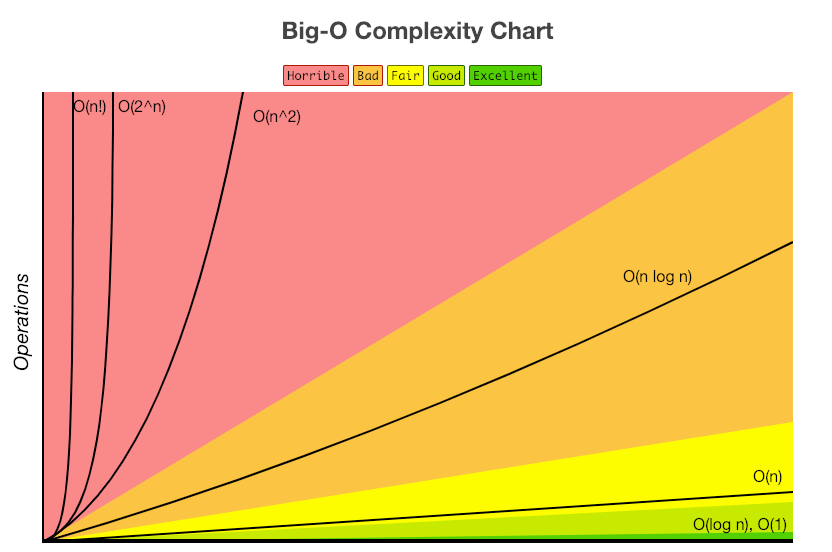

# Big-O 표기법

알고리즘의 성능을 수학적으로 표현하는 방법

- 시간복잡도와 공간복잡도를 나타낼 때 사용된다
- 최소한으로 보장되는 성능을 표기하기 때문에 가장 일반적으로 사용됨

## Big-O 특징

1. 상수항을 무시한다.
2. 최고차항만 표기한다.
3. 계수를 무시한다.

## 실행속도

실행 속도 $O(1)$ < $O(logn)$ < $O(n)$ < $O(nlogn)$ < $O(n^2)$ < $O(2^n)$

## 빅오 표현식을 단순화하는 데 도움을 주는 규칙

- **1️⃣ 산술 연산은 상수다. (= 항상 일정한 값을 취한다.)**
- **2️⃣ 변수에 값을 할당하는 것은 상수다.**
- **3️⃣ 인덱스를 사용해 배열에 접근하거나, 키를 사용해 객체에 접근하는 것 또한 상수다.**
- **4️⃣ 반복문이 있는 경우, 복잡도 = 루프의 길이 \* 루프 안에 있는 연산들**

## 백준 시간복잡도 계산

|                 | 시간복잡도               | 대표 알고리즘                       |
| --------------- | ------------------------ | ----------------------------------- |
| n <= 10         | $O(n!)$                  | Bruteforcing                        |
| n <= 25         | $O(2^n)O(n^2*2^n)$       | Bitmask DP                          |
| n <= 50         | $O(\sqrt{2}^n)$          | MITM                                |
| n <=500         | $O(n^3)$                 | Matrix Chain Multiplication         |
| n <= 5,000      | $O(n^2)$                 |                                     |
| n <= 100,000    | $O(n\sqrt{n})O(nlog^2n)$ | Mo's                                |
| n <= 1,000,000  | $O(nlogn)$               | Sorting, LIS, etc...                |
| n <= 10,000,000 | $O(n)$                   | Fibonacci(DP), DFS, Tree traversal  |
| 그 이상         | $O(logn)$, $O(1)$        | Binary search, Exponential, Hashing |
