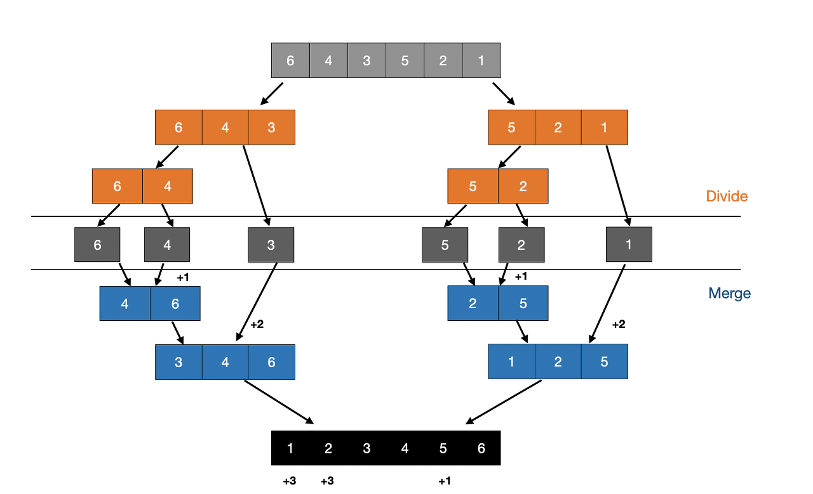

# 분할정복

문제를 작게 분할한 후 각각을 정복하는 알고리즘

- 작은 문제는 원래 문제와 같은 형태를 가지며, 작은 문제는 원래 문제의 일부분이 된다.

## 분할정복 알고리즘 탐색 과정

1. 분할
   - 문제를 비슷한 유형의 더 작은 하위 문제로 반복적으로 나눈다.
2. 정복
   - 각 하위 문제를 재귀적으로 해결한다. 하위 문제의 규모가 충분히 작으면 탈출 조건에 따라 해결한다.
3. 결합
   - 정복한 문제들을 통합하여 원래 문제의 답을 얻어 해결한다.

## 분할정복 예시

### 1. 합병 정렬

- 분할: 배열을 반으로 나눈다.
- 정복: 부분 배열을 정렬한다. 부분 배열의 크기가 충분히 작지 않으면(left<right) 순환 호출을 이용하여 다시 분할 정복 방법을 적용한다.
- 결합: 정렬된 부분 배열을 합병하여 전체 배열을 정렬한다.

### 2. 퀵 정렬

- 분할: 피봇을 기준으로 2개의 부분 배열로 나눈다.
- 정복: 피봇을 기준으로 피봇보다 작은 값은 왼쪽, 큰 값은 오른쪽으로 나눈다. 부분 배열의 크기가 충분히 작지 않으면(left<right) 순환 호출을 이용하여 다시 분할 정복 방법을 적용한다.
- 결합: 정복 과정에서 이미 정렬되어 있기 때문에 추가적인 결합 과정이 필요하지 않다.

### 3. 이진 탐색

- 분할: 배열의 중간 값을 기준으로 왼쪽과 오른쪽으로 나눈다.
- 정복: 탐색키가 가운데 원소보다 작으면 왼쪽 부분 배열을 대상으로 이진 탐색을 순환 호출하고, 크면 오른쪽 부분 배열을 대상으로 이진 탐색을 순환 호출한다.
- 결합: 탐색 결과가 직접 반환되기 때문에 결합 과정이 필요하지 않다.

## Reference

[Divide and Conquer Algorithm : 분할정복 알고리즘을 알아보자](https://olrlobt.tistory.com/45)
[분할정복 알고리즘 정리 (합병 정렬, 퀵 정렬, 이진 탐색)](https://loosie.tistory.com/237)
