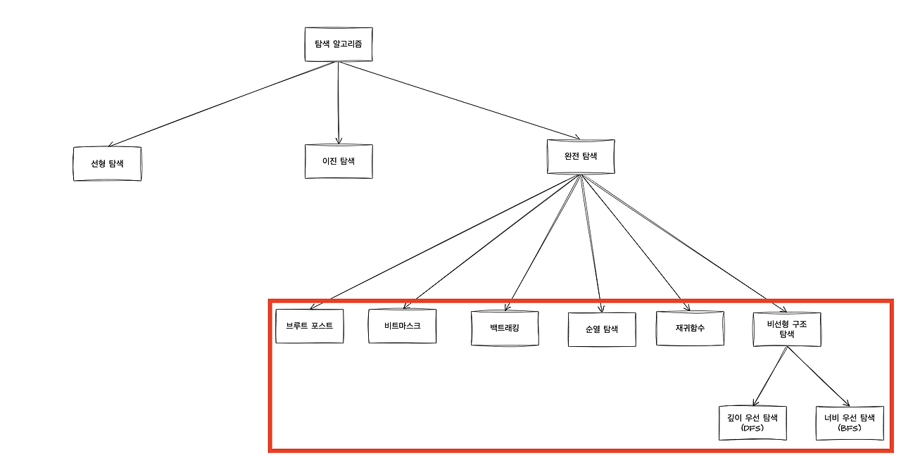

# 완전 탐색

## 완전 탐색이란?

컴퓨터의 빠른 계산 능력을 이용하여 **가능한 모든 경우의 수**를 탐색하는 방법이다.

완전 탐색은 알고리즘이라기 보다는 문제를 해결하는 방법 중 하나이다.

## 완전 탐색 기법

완전 탐색 방법을 사용하기 위해서 여러 알고리즘 기법이 이용된다.

### 1. Brute Force

'모든 경우의 수를 탐색'하면서 원하는 결과를 얻는 알고리즘 기법

**장점**
가능한 모든 경우를 다 검사하기 때문에 예상된 결과를 얻을 수 있음

**단점**
경우의 수가 많아질수록 시간이 오래 걸림

### 2. 비트 마스크

'모든 경우의 수'를 이진수로 표현하고 '비트 연산'을 통해 원하는 결과를 빠르게 얻는 알고리즘

**장점**
이진수 연산을 이용하여 계산 속도가 빠르다

**단점**
경우의 수가 많아질수록 메모리 사용량이 늘어남

### 3. 순열

'순열'을 이용하여 '모든 경우의 수'를 탐색하는 알고리즘

**장점**
경우의 수가 적을 때 빠르게 결과를 얻을 수 있음

**단점**
경우의 수가 많아질수록 시간이 오래 걸림

### 4. 백트래킹

결과를 얻기 위해 진행하는 도중에 '막히게 되면' 이전 단계로 돌아가서 다른 경우를 탐색하는 알고리즘

**장점**
결과를 얻기 위해 불필요한 계산을 줄일 수 있음

**단점**
재귀 함수를 이용하기 때문에 스택 오버플로우가 발생할 가능성이 있음

### 5. DFS / BFS

DFS

- 로트 노드에서 시작하여 다음 분기로 넘어가기 전에 해당 분기를 완벽하게 탐색하는 방법

BFS

- 로트 노드에서 시작하여 인접한 노드를 먼저 탐색하는 방법

**장점**
미로 찾기, 경로 탐색 등에 사용하기 좋음

**단점**
최악의 경우 모든 노드를 탐색해야 할 수 있음

### 6. 재귀함수

자기 자신을 호출하여 모든 가능한 경우의 수를 체크하면서 최적의 해답을 얻는 방식

**장점**
코드가 간결하고 이해하기 쉬움

**단점**
재귀 함수를 이용하기 때문에 스택 오버플로우가 발생할 가능성이 있음

## 완전 탐색의 시간 복잡도

| 알고리즘    | 시간복잡도           |
| ----------- | -------------------- |
| Brute Force | $O(nm)$              |
| 비트 마스크 | $O(2^n*n)$           |
| 순열        | $O(n!)$              |
| 백트래킹    | 최악의 경우, $O(n!)$ |
| DFS / BFS   | $O(V+E)$             |
| 재귀함수    | $O(n)$               |

## Reference

[완전 탐색 알고리즘](https://rebro.kr/59)
[완전 탐색 이해하기](https://adjh54.tistory.com/196)
