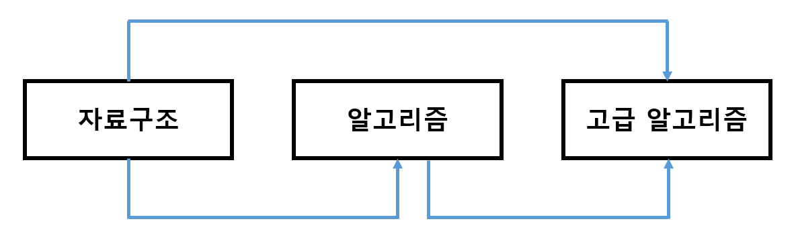

# 위상 정렬

정렬 알고리즘인데, 순서가 정해져 있어요.

## 개념

사이클이 없는 방향 그래프(DAG)의 모든 노드를 방향성에 거스르지 않도록 순서대로 나열하는 것.

ex) 대학교 선수과목

## 특징

- 사이클이 없는 방향 그래프(DAG)에만 적용 가능
- 여러 가지 답이 존재할 수 있다.
- 모든 원소를 방문하기 전에 큐가 빈다면 사이클이 존재한다고 판단
- 스택을 활용한 DFS로도 구현 가능
- 시간 복잡도
  - 인접 리스트로 구현한 그래프 : O(V + E)
  - 인접 행렬로 구현한 그래프 : O(V^2)

## 진입 차수와 진출 차수

- 진입 차수 (Indegree) : 특정 노드로 들어오는 간선의 개수
- 진출 차수 (Outdegree) : 특정 노드에서 나가는 간선의 개수

## 위상 정렬 알고리즘 동작 과정

1. 진입 차수가 0인 노드를 큐에 넣는다.
2. 큐가 빌 때까지 다음의 과정을 반복한다.
   - a. 큐에서 원소를 꺼내 해당 노드에서 나가는 간선을 그래프에서 제거한다.
   - b. 새롭게 진입 차수가 0이 된 노드를 큐에 넣는다.

## 위상 정렬 구현

[위상 정렬 구현 바로가기](./code/topological_sort.py)

## Reference

- [[알고리즘] 위상 정렬 (Topological Sorting)](https://velog.io/@kimdukbae/%EC%9C%84%EC%83%81-%EC%A0%95%EB%A0%AC-Topological-Sorting)
- [위상 정렬(Topological sort) 개념 및 구현](https://yoongrammer.tistory.com/86)
