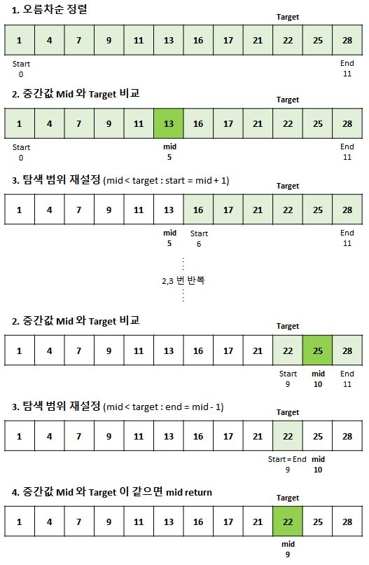

# 이진 탐색

## 이진 탐색(Binary Search)이란?

`정렬된 배열`에서 특정한 값을 찾아내는 알고리즘

- 이진탐색은 탐색 범위를 절반씩 줄여나가기 때문에 선형 탐색보다 훨씬 빠르다.
- 배열이 정렬되어 있어야만 사용할 수 있다.
- 반복문과 재귀 두 가지 방법을 사용할 수 있다.

[이진 탐색 파이썬으로 구현하기](./code/binary_search.py)

## 이진 탐색 시간 복잡도

- $O(logN)$

## Reference

[이진 탐색 이해하기](https://adjh54.tistory.com/187)
[이분 탐색 / 이진 탐색](https://code-angie.tistory.com/3)
