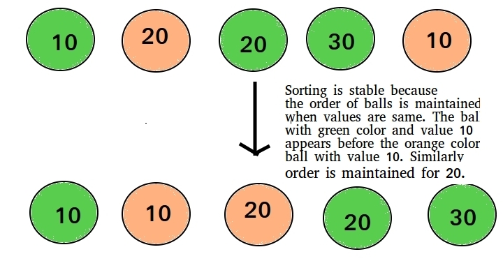
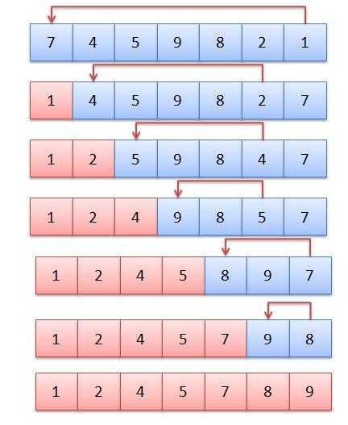
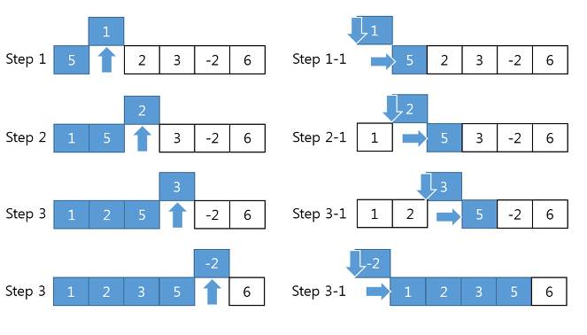
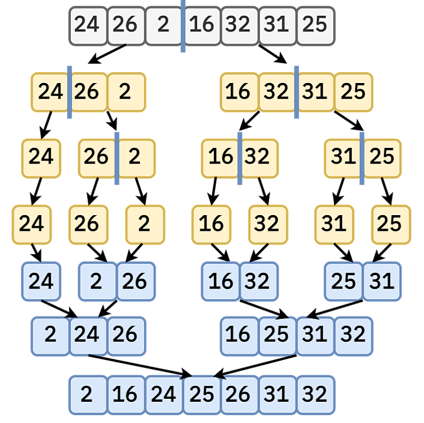
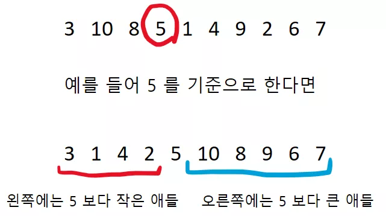
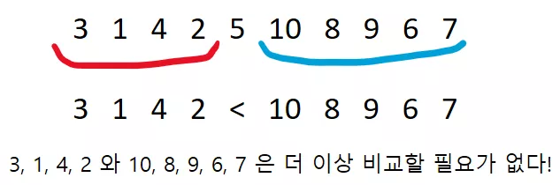

# 정렬

## 안정성

키-값 쌍을 가진 객체들 중 같은 키를 가진 객체들의 순서가 정렬 이후에도 유지되는 것

## 정렬 알고리즘 비교

| 구분      | 최상       | 평균       | 최악       | 메모리    | 안정성 |
| --------- | ---------- | ---------- | ---------- | --------- | ------ |
| 선택 정렬 | $O(n^2)$   | $O(n^2)$   | $O(n^2)$   | $O(1)$    | X      |
| 삽입 정렬 | $O(n)$     | $O(n^2)$   | $O(n^2)$   | $O(1)$    | O      |
| 버블 정렬 | $O(n)$     | $O(n^2)$   | $O(n^2)$   | $O(1)$    | O      |
| 합병 정렬 | $O(nlogn)$ | $O(nlogn)$ | $O(nlogn)$ | $O(n)$    | O      |
| 퀵 정렬   | $O(nlogn)$ | $O(nlogn)$ | $O(n^2)$   | $O(logn)$ | X      |
| 힙 정렬   | $O(nlogn)$ | $O(nlogn)$ | $O(nlogn)$ | $O(1)$    | X      |
| Tim 정렬  | $O(n)$     | $O(nlogn)$ | $O(nlogn)$ | $O(n)$    | O      |

## 선택 정렬

배열의 **정렬되지 않은 부분**에서 최솟값이나 최댓값을 찾아서 **정렬되지 않은 부분**의 첫 원소와 교환하는 방식으로 정렬하는 알고리즘

[선택 정렬 파이썬으로 구현하기](./code/selection_sort.py)

### 선택 정렬 시간 복잡도

Best: $O(n^2)$
Arg: $O(n^2)$
Worst: $O(n^2)$

## 삽입 정렬

정렬되지 않는 배열에서 현재 인덱스의 값을 왼쪽에 있는 모든 값과 차례대로 비교하여 적절한 위치에 삽입하는 방식으로 정렬하는 알고리즘

[삽입 정렬 파이썬으로 구현하기](./code/insertion_sort.py)

### 삽입 정렬 시간 복잡도

Best: $O(n)$
Arg: $O(n^2)$
Worst: $O(n^2)$

## 합병 정렬

배열을 작은 하위 배열로 나눠서 정렬한 후에 다시 합병하는 정렬 알고리즘

- 분할 정복 알고리즘에 해당한다.
- 재귀 알고리즘이다.

[합병 정렬 파이썬으로 구현하기](./code/merge_sort.py)

### 합병 정렬 시간 복잡도

Best: $O(nlogn)$
Arg: $O(nlogn)$
Worst: $O(nlogn)$

## 퀵 정렬

- 분할 정복 알고리즘
- 추가 메모리 공간이 필요 없다
- 불안정 정렬

[퀵 정렬 파이썬으로 구현하기](./code/quick_sort.py)

### 퀵 정렬 시간 복잡도

Best: $O(nlogn)$
Arg: $O(nlogn)$
Worst: $O(n^2)$
