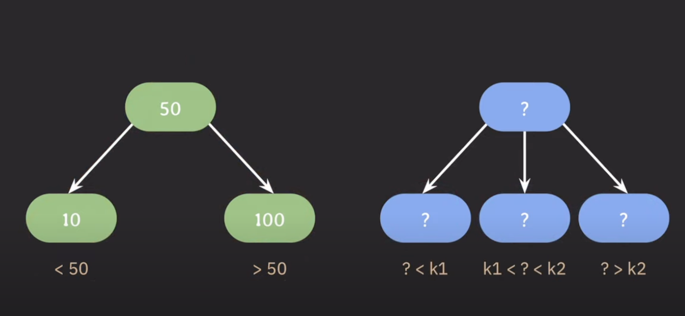

# B-Tree

BST(이진 탐색 트리)는 최대 자식 노드의 개수가 2개인 트리.

자식 노드를 3개 가지고 싶다면?

자식 노드들의 값의 범위를 지정해주기 위해 2개의 기준(k1, k2)이 필요하다.
자식 노드를 서브 트리로 확장한 개념이 B-Tree이다.

## B-Tree의 특징

- 자녀 노드의 최대 개수를 늘리기 위해서 **부모 노드에 key를 1개 이상 저장**한다.
- 부모 노드의 key들을 오름차순으로 정렬한다.
- 정렬된 순서에 따라 자녀 노드들의 key 값의 범위가 결정된다.
- internal node의 key 수가 x개라면 자녀 노드의 개수는 _언제나_ x+1개이다.

> 자녀 노드의 최대 개수를 입맛에 맞게 결정해서 쓸 수 있다.

## B-Tree 파라미터

- `M` : 각 노드의 최대 자식 노드 개수
  - M차 B-Tree : 각 노드의 최대 자식 노드 개수가 M개인 B-Tree
- `M-1` : 각 노드의 최대 key 수
- `⌈M/2⌉` : 각 노드의 최소 자식 노드 개수
- `⌈M/2⌉-1` : 각 노드의 최소 key 수

|                | 최소        | 최대 |
| -------------- | ----------- | ---- |
| 자식 노드 개수 | ⌈M/2⌉\*     | M    |
| key 수         | ⌈M/2⌉-1\*\* | M-1  |

\* root node, leaf node 제외 
\*\* root node 제외

## B-Tree의 삽입

### 두 가지 포인트

1. 추가는 항상 leaf 노드에 한다.
2. 노드가 넘치면 가운데 key를 기준으로 좌우 key를 나누고 가운데 key는 승진한다.

노드가 넘친다 = key의 개수가 M-1개 이상이 된다.

## Reference

- [(1부) B tree의 개념과 특징, 데이터 삽입이 어떻게 동작하는지를 설명합니다! (DB 인덱스과 관련있는 자료 구조)](https://youtu.be/bqkcoSm_rCs?si=T31nJGyHa2hpyAKa)
- [(2부) B tree 데이터 삭제 동작 방식을 설명합니다 (DB 인덱스과 관련있는 자료 구조)](https://www.youtube.com/watch?v=H_u28u0usjA&t=1091s)
- [(3부) B tree가 왜 DB 인덱스(index)로 사용되는지를 설명합니다](https://www.youtube.com/watch?v=liPSnc6Wzfk)
