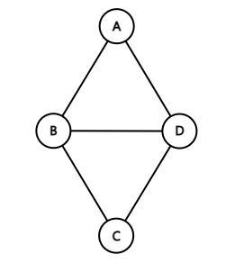
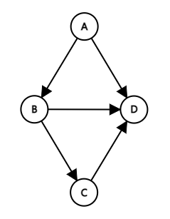
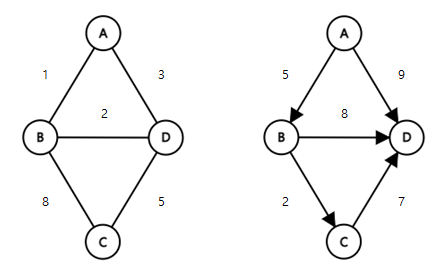
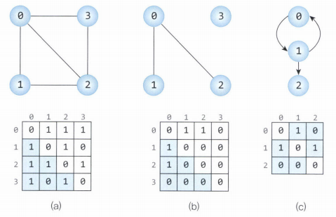
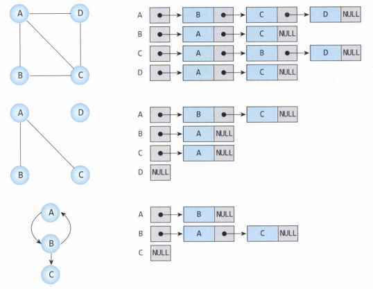
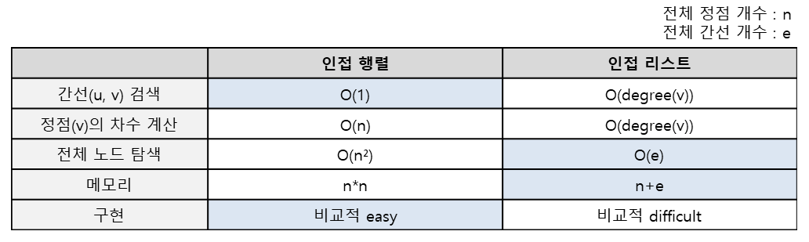

# 그래프

## 정의

정점(Vertex)과 간선(Edge)으로 이루어진 자료구조
그래프 G는 G = (V, E)로 표현한다.

- V는 정점의 집합
- E는 간선들의 집합

## 용어

### 정점(Vertex)

- 노드라고도 함
- 데이터를 저장하는 공간

### 간선(Edge)

- 링크라고도 함
- 정점 간의 관계를 나타내는 선

### 인접 정점(Adjacent Vertex)

- 하나의 정점에서 간선에 의해 직접 연결된 정점

### 차수(Degree)

- 정점에 연결된 간선의 수

**방향 그래프에서의 차수**

- 진입 차수(In-Degree) : 정점으로 들어오는 간선의 수
- 진출 차수(Out-Degree) : 정점에서 나가는 간선의 수

### 경로(Path)

- 정점들을 연결하는 간선들의 순서된 집합

### 경로의 길이(Lenght)

- 경로를 구성하는 간선의 수

## 종류

### Undirected Graph(무방향 그래프)

- 두 정점을 연결하는 간선에 방향이 없는 그래프
- 정점 V1과 V2를 연결하는 간선은 (V1, V2)로 표현한다.
- (V1, V2)와 (V2, V1)는 같은 간선이다.
- V(G1) = {A, B, C, D} , E(G1) = {(A, B), (B, C), (C, D), (D, A)}

### Directed Graph(방향 그래프)

- 간선에 방향이 있는 그래프 / 간선이 가리키는 방량으로만 이동할 수 있다.
- 정점 V1에서 V2로 가는 간선은 <V1, V2>로 표현한다.
- <V1, V2>와 <V2, V1>은 다른 간선이다.
- V(G2) = {A, B, C, D} , E(G2) = {<A, B>, <A, D>, <B, C>, <B, D>, <C, D>}

### Weighted Graph(가중치 그래프)

- 간선에 가중치가 있는 그래프

## 표현 방식

그래프는 `인접 행렬` 또는 `인접 리스트`로 표현할 수 있다.

### 인접 행렬(Adjacency Matrix)

그래프의 정점을 2차원 배열로 만든 것

정점의 개수가 `n`이라면 `n * n` 행렬이 된다.

- 무방향 그래프 : 인접 행렬이 대칭적 구조를 가짐
- 가중치 그래프 : 행렬에서 0과 1이 아니라 각 간선의 가중치 값이 저장됨
  - 가중치가 0인 것과 간선이 없는 것이 구별되어야 함

**장점**

- 두 정점을 연결하는 간선을 조회할 때 시간복잡도가 O(1)이다.
- 정점의 차수를 구할 때 시간복잡도가 O(n)이다.
  - 인접행렬의 i번째 행의 값을 모두 더하면 됨

**단점**

- 많은 메모리 공간을 차지한다.
- 모든 간선의 수를 알아내려면 인접 행렬을 모두 조회해야 한다. O(n^2)

### 인접 리스트(Adjacency List)

각 정점에 인접한 정점들을 **연결리스트**로 표현하는 방법

- 정점의 개수만큼 인접리스트 존재
- 각 인접 리스트에는 인접한 정점 정보가 저장
- 무방향 그래프의 경우 간선이 추가되면 각각의 정점 인접리스트에 반대편 정점의 노드를 추가해야 함

**장점**

- 메모리 공간을 효율적으로 사용한다. (존재하는 간선만 관리)
- 모든 간선의 수를 알아내려면 각 정점의 헤더 노드부터 모든 인접 정점을 조회해야 한다. O(n + e)

**단점**

- 두 정점을 연결하는 간선을 조회하거나 정점의 차수를 알기 위해 정점의 차수만큼의 시간이 소요된다. O(degree(v))

## Reference

- [[자료구조] 그래프(Graph)의 개념 설명](https://leejinseop.tistory.com/43)
- [[자료구조] 그래프 (Graph) - 인접행렬 vs 인접리스트, DFS, BFS, Connected Component, Spanning Tree](https://suyeon96.tistory.com/32)
