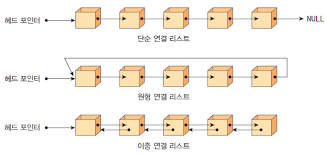

# Linked List

`연결 리스트`는 동적인 데이터를 처리하는 것과 관련된 수많은 문제의 근간을 이루는 자료구조

## 연결 리스트 특징

- Node라는 구조체로 이루어져 있다.
- Node : 데이터 값 + 다음 노드의 주소(포인터)를 저장한다.
- 메모리에 비연속적으로 저장된다.
- 데이터의 삽입, 삭제가 용이하다.
- 데이터의 검색이 어렵다.

## 연결 리스트의 종류

면접에서는 대부분 **단일 연결 리스트 문제**가 나오는 편

### 단일 연결 리스트

- 각 Node에는 리스트의 다음 Node의 주소(link)가 저장되어 있다.
- 단일 연결 리스트의 첫 번째 Node를 `헤드(head)`라고 한다.
- 단일 연결 리스트의 마지막 Node는 `꼬리(tail)`라고 부르며, 비어 있거나 `NULL`을 가리킨다.
- 조회를 위해 처음부터 순차적으로 탐색해야 한다.
- 이를 위해 `head`에 대한 포인터를 가지고 있어야 한다.

### 이중 연결 리스트

- 각 Node에는 리스트의 다음 Node와 이전 Node의 주소(link)가 저장되어 있다.
- 양방향으로 탐색이 가능하다.
- `head`와 `tail`을 가지고 있다.
- `head`의 이전 Node는 `NULL`을 가리키고, `tail`의 다음 Node는 `NULL`을 가리킨다.

### 원형 연결 리스트

- `head`나 `tail`이 없는 대신, 마지막 Node가 첫 번째 Node를 가리킨다.
- 모든 Node가 순환적으로 연결되어 있다.
- 무한 루프에 빠질 수 있으므로 주의해야 한다.

## 연결 리스트 메서드

- `appendleft(x)`: 연결 리스트 맨 앞에 데이터 삽입
- `append(x)`: 연결 리스트 맨 뒤에 데이터 삽입
- `popleft()`: 연결 리스트 맨 앞의 데이터 삭제
- `pop()`: 연결 리스트 맨 뒤의 데이터 삭제
- `insert(i, x)`: 연결 리스트의 i번째 위치에 데이터 삽입
- `remove(x)`: 연결 리스트에서 첫 번째로 나오는 x 삭제

### 특수 메서드

- `__len__`: 연결 리스트의 길이 반환
- `__contains__`: 연결 리스트 내의 값을 가지고 있는지 확인
- `__str__`: 연결 리스트를 문자열로 변환

## Reference
