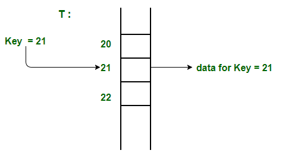

# Hash Table

효율적인 탐색을 위한 자료구조로, `key - value 쌍`을 저장하는 자료구조
해시 함수를 이용해 key 값을 해시값으로 변환하고, 이 해시값을 주소로 이용해 value를 저장하거나 찾는다.

## 해시테이블이란?

## 해시테이블이 왜 필요할까?

### 직접 주소 지정 방식의 문제점

**직접 주소 지정 방식** :
key 값을 주소로 사용하는 방식 (ex. key = 100 이면 100번째 주소에 저장)

- 불필요한 공간 낭비
  - 키 값들이 연속적이지 않을 수 있기 때문에, 빈 공간이 많이 생길 수 있다.
- key가 다양한 자료형을 담을 수 없다.
  - key가 다양한 자료형일 경우, 주소를 지정하기 어렵다.

### 해시테이블의 장점

해시테이블은 해시 함수로 key 값을 해시값으로 변환하기 때문에, key 값으로 다양한 자료형을 담을 수 있다.
또한, 해시함수를 통해 해시값을 얻기 때문에, key 값이 연속적이지 않아도 된다.

## 해시 함수

key 값을 해시값으로 변환하는 함수

### 잘 설계된 해시 함수

- 연산이 빨라야 한다.
- 해시값이 최대한 중복되지 않아야 한다.
- 해시값이 최대한 고르게 분포되어야 한다.

## Collision

해시함수를 통해 얻은 **해시값이 같은 경우**, Collision이 발생한다.

- key 값은 중복될 수 없지만, 같은 해시값을 가진 key 값이 존재할 수 없다.

### 충돌 해결 방법

**Open Addressing**

충돌이 발생하면 비어있는 slot에 저장하는 방식
추가적인 메모리를 사용하지 않는다.

- **Linear Probing**
  - 충돌이 발생하면 다음 slot에 저장 $(+1, +2, +3, ...)$
- **Quadratic Probing**
  - 충돌이 발생하면 $i^2$ 번째 slot에 저장 $(+1^2, +2^2, +3^2, ...)$
- **Double Hashing**
  - 충돌이 발생하면 또 다른 해시함수를 이용해 slot을 찾는다.

**Chaining**

충돌이 발생하면 같은 해시값을 가진 key들을 연결리스트로 연결하는 방식
추가적인 메모리를 사용한다.

## 해시테이블 파이썬 구현

[바로가기](./code/hash_table.py)

## Reference

[[DS] 해쉬 테이블(Hash Table)이란?](https://baeharam.netlify.app/posts/data%20structure/hash-table)
