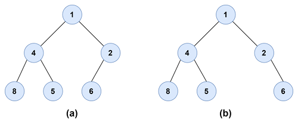
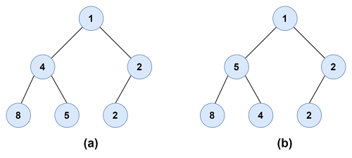

# Heap & Priority Queue

## Priority Queue

FIFO인 큐와 달리, 들어가는 자료에 우선순위를 매겨서 들어간 순서와 관계없이 나갈 때는 **우선순위가 높은 자료**가 먼저 나가는 자료구조

## Heap

우선순위 큐를 구현한 자료 구조

### Heap의 규칙

1. 노드를 왼쪽에서 오른쪽으로 하나씩 빠짐없이 채워나간다.
   
2. 최소 힙은 부모 노드가 자식 노드의 값보다 작거나 같아야 한다.
   - 파이썬 heapq 모듈은 최소 힙을 지원한다.
     

## 파이썬으로 heapq 모듈 구현하기

[바로가기](./code/heap.py)

### 메서드

- heappush(heap, data): heap에 data를 삽입한다.
- heappop(heap): heap에서 루트 노드의 데이터를 삭제하고 반환한다.
- heapify(x): 리스트 x를 heap 구조로 변환한다.

## Reference

[파이썬으로 힙(heap) 구현하기](https://wikidocs.net/194445)
